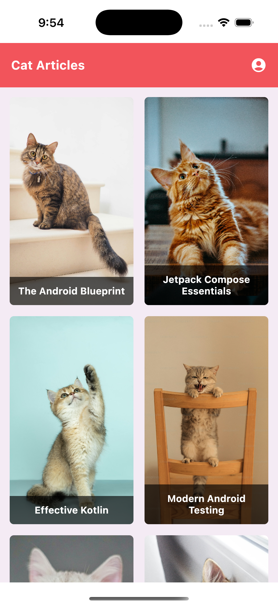
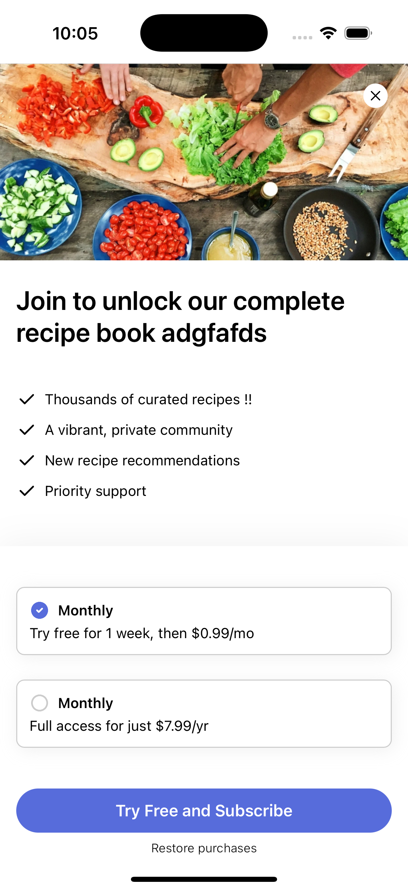

<h1 align="center">Cat Paywall Kotlin Multiplatform</h1></br>

<p align="center">
  <a href="https://opensource.org/licenses/Apache-2.0"></a>
  <a href="https://android-arsenal.com/api?level=24"></a>
  <a href="https://kotlinlang.org"></a>
  <a href="https://www.jetbrains.com/lp/compose-multiplatform/"></a>
  <a href="https://github.com/RevenueCat/cat-paywalls-kmp/actions/workflows/build.yml"></a>
</p>

Cat Paywalls KMP is the Kotlin Multiplatform version of [Cat Paywall Compose](https://github.com/RevenueCat/cat-paywall-compose), demonstrating in-app purchases, entitlement, and server-driven paywalls on Kotlin Multiplatform for both Android and iOS using [RevenueCat's purchases-kmp SDK](https://github.com/RevenueCat/purchases-kmp) and Compose Multiplatform. This project showcases how to share paywall and subscription logic across platforms while maintaining native performance.

The purpose of this repository is to demonstrate the following:

- In-app purchases (subscriptions) using Google Play Billing and App Store.
- Server-driven UI based paywall dialog with the RevenueCat's paywall editor.
- Checking user entitlements across platforms.
- Full UI implementation using Compose Multiplatform.
- A multi-module KMP project structure with shared business logic.

## 📷 Previews

<p align="center">


</p>

<p align="center">



</p>

<a href="https://www.revenuecat.com/docs/getting-started/quickstart?utm_medium=organic&utm_source=github&utm_campaign=advocate">

</a>

## 🐈 RevenueCat In-App Purchase SDK

Cat Paywalls KMP is built using the [RevenueCat SDK for Kotlin Multiplatform](https://github.com/RevenueCat/purchases-kmp) to implement in-app subscriptions and a paywall system on both Android and iOS. [RevenueCat](https://www.revenuecat.com?utm_medium=organic&utm_source=github&utm_campaign=advocate) handles first-party purchases across platforms, manages customer data, supports A/B testing, and provides source-of-truth analytics.

## ✍️ Technical Content

- [Turn Your App into Revenue: Building Paywalls in Android With Jetpack Compose](https://www.revenuecat.com/blog/engineering/build-paywalls-compose/): In-app subscriptions have become a popular way to monetize mobile applications that offer recurring value to users. In this article, you'll learn how to seamlessly implement in-app subscriptions and paywall features in Android using Jetpack Compose and the RevenueCat SDK.
- [How to monetize Android apps with ad-free subscriptions using RevenueCat](https://www.revenuecat.com/blog/engineering/ad-free-subscriptions-android/): Most apps monetize through ads using things like AdMob or Audience Network. To maximize your earnings with ads, you need to show as many of them as possible, which makes for a pretty lousy user experience.
- [Server-driven UI SDK on Android: how RevenueCat enables remote paywalls without app updates](https://www.revenuecat.com/blog/engineering/server-driven-android/): In this article, we'll explore the concept of server-driven UI, with a focus on how RevenueCat's Paywall Editor enables you to build and remotely update paywalls—without needing app updates—using RevenueCat's Android SDK.
- [Simplify in-app purchase unit testing with RevenueCat’s Test Store](https://www.revenuecat.com/blog/engineering/testing-test-store/): In-app purchase testing has long been a pain point in Android development. Setting up Google Play sandbox environments, managing test accounts, waiting for purchase verification, dealing with cached state… the friction is real. Luckily, RevenueCat’s Test Store is a solution to this problem — offering instant testing without the complexity of real billing systems. But the real benefit of Test Store isn’t just its simplified setup, it’s how it enables true unit testing of purchase flows, with minimal infrastructure.

## 💻 [Codelab](https://revenuecat.github.io/)

1. [RevenueCat Google Play Integration](https://revenuecat.github.io/codelab/google-play/codelab-1-google-play-integration/index.html#0): In this codelab, you'll learn how to:
   - Properly configure products on Google Play.
   - Set up the RevenueCat dashboard and connect it to your Google Play products.
   - Understanding Product, Offering, Package, and Entitlement.
   - Create paywalls using the [Paywall Editor](https://www.revenuecat.com/docs/tools/paywalls/creating-paywalls#using-the-editor?utm_medium=organic&utm_source=github&utm_campaign=advocate).

2. [RevenueCat App Store Integration](https://revenuecat.github.io/codelab/app-store/app-store/index.html#0)
   - Properly configure products on App Store Connect.
   - Set up the RevenueCat dashboard and connect it to your App Store products.
   - Understanding Product, Offering, Package, and Entitlement.
   - Create paywalls using the Paywall Editor.

3. [Kotlin Multiplatform Purchases & Paywalls Overview](https://revenuecat.github.io/codelab/kmp/codelab-3-kmp-sdk/index.html#0): In this codelab, you will:
   - Integrate the Android KMP SDK into your project
   - Implement in-app purchases in your Android application
   - Learn how to distinguish between paying and non-paying users
   - Build a paywall screen, which is based on a server-driven UI approach

## 🔨 How to Build This Project

You can build this project with the few steps below:

1. Configure your RevenueCat dashboard following [RevenueCat Google Play Integration codelab](https://revenuecat.github.io/codelab/google-play/codelab-1-google-play-integration/index.html#0), and [RevenueCat App Store Integration codelab](https://revenuecat.github.io/codelab/app-store/app-store/index.html#0).
2. In RevenueCat dashboard, go to the "API Keys" menu on the left side, and copy the SDK API keys for Play Store and App Store.
3. Put your Play Store API key to the [Application class](https://github.com/revenuecat/cat-paywalls-kmp/blob/main/composeApp/src/androidMain/kotlin/com/revenuecat/catpaywalls/CatArticlesApplication.kt#L36) for Android, and [iosApp](https://github.com/revenuecat/cat-paywalls-kmp/blob/main/iosApp/iosApp/iosAppApp.swift#L9) for iOS.
4. Replace the [applicationId](https://github.com/revenuecat/cat-paywalls-kmp/blob/main/composeApp/build.gradle.kts#L113) for your Google Play package name, configured on your ReveneuCat dasboard. For iOS, change the [product bundle id](https://github.com/revenuecat/cat-paywalls-kmp/blob/main/iosApp/iosApp.xcodeproj/project.pbxproj#L368) and [here](https://github.com/advocacies/cat-paywalls-kmp/blob/main/iosApp/iosApp.xcodeproj/project.pbxproj#L391) with your App Bundle ID.
5. Run the project.

## 🛠 Tech Stack & Open Source Libraries

- Android minimum SDK level 24, iOS 15+.
- 100% [Compose Multiplatform](https://www.jetbrains.com/lp/compose-multiplatform/) based + [Coroutines](https://github.com/Kotlin/kotlinx.coroutines) + [Flow](https://kotlin.github.io/kotlinx.coroutines/kotlinx-coroutines-core/kotlinx.coroutines.flow/) for asynchronous.
- [RevenueCat SDK for KMP](https://github.com/RevenueCat/purchases-kmp): RevenueCat allows you to implement in-app subscriptions, dynamic paywalls, actionable analytics, and plug-and-play experimentation tools across Android and iOS.
- [Ktor](https://ktor.io/): Kotlin-first HTTP client for networking with platform-specific engines (OkHttp for Android, Darwin for iOS).
- [Metro](https://github.com/ZacSweers/metro): A compile-time dependency injection library for Kotlin Multiplatform, powered by KSP.
- [Landscapist Coil3](https://github.com/skydoves/landscapist): Image loading library for Compose Multiplatform with placeholder support.
- [Navigation Compose](https://www.jetbrains.com/help/kotlin-multiplatform-dev/compose-navigation-routing.html): JetBrains' Navigation library for Compose Multiplatform.
- [JetBrains Lifecycle ViewModel](https://www.jetbrains.com/help/kotlin-multiplatform-dev/compose-viewmodel.html): ViewModel support for Compose Multiplatform with lifecycle awareness.

## 🏛️ Architecture

This project follows [Google's official architecture guidance](https://developer.android.com/topic/architecture) with a multi-module structure adapted for Kotlin Multiplatform.

The project is organized into three main layers:
- **composeApp**: The main application module containing platform entry points (`androidMain`, `iosMain`) and shared app code (`commonMain`).
- **feature modules**: Individual feature screens like `home`, `article`, `paywalls`, `account`, and `subscriptions`.
- **core modules**: Shared foundation including `model` (data classes), `network` (Ktor client), `data` (repositories), `designsystem` (theme & components), and `navigation` (routes).

Each feature module depends on core modules, and the composeApp module brings everything together with platform-specific configurations.

## 🤝 Contribution

Anyone can contribute and improve this project following the [Contributing Guideline](CONTRIBUTING.md).

## 📄 Image Credits

All cat images used in this demo project are copyrighted and belong to [Unsplash](https://unsplash.com/).

## Find this repository useful? 😻

Support it by joining __[stargazers](https://github.com/revenuecat/cat-paywalls-kmp/stargazers)__ for this repository. :star: <br>
Also, __[follow the main contributor](https://github.com/skydoves)__ on GitHub for the next creations!

# License
```xml
Copyright (c) 2025 RevenueCat, Inc.

Licensed under the Apache License, Version 2.0 (the "License");
you may not use this file except in compliance with the License.
You may obtain a copy of the License at

   http://www.apache.org/licenses/LICENSE-2.0

Unless required by applicable law or agreed to in writing, software
distributed under the License is distributed on an "AS IS" BASIS,
WITHOUT WARRANTIES OR CONDITIONS OF ANY KIND, either express or implied.
See the License for the specific language governing permissions and
limitations under the License.
```
